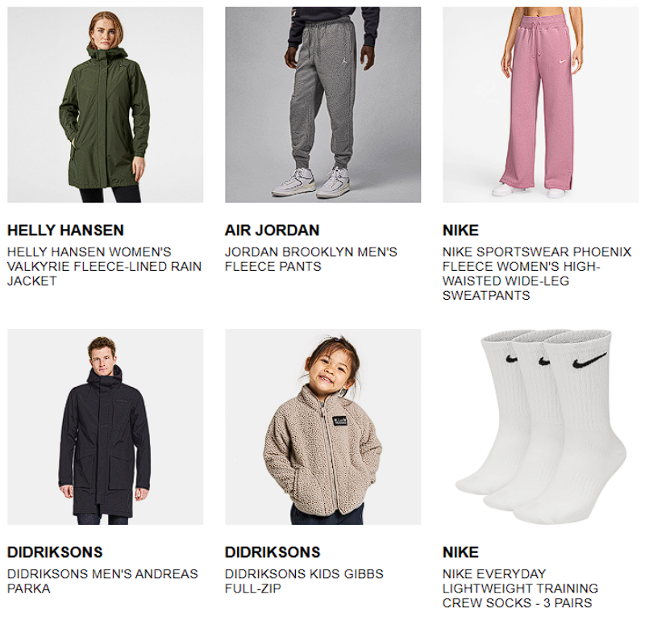
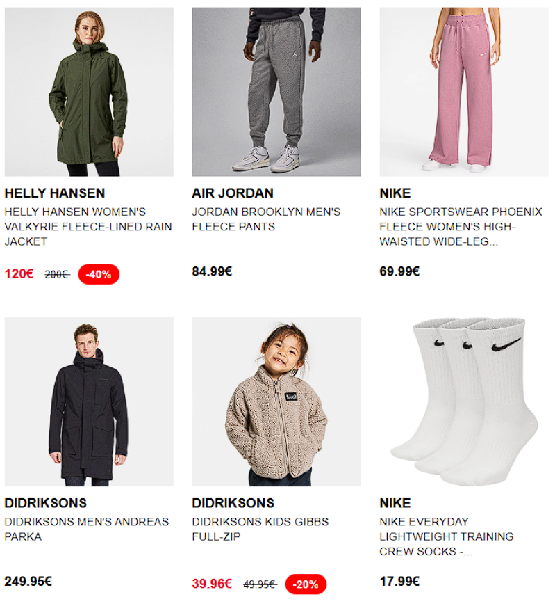
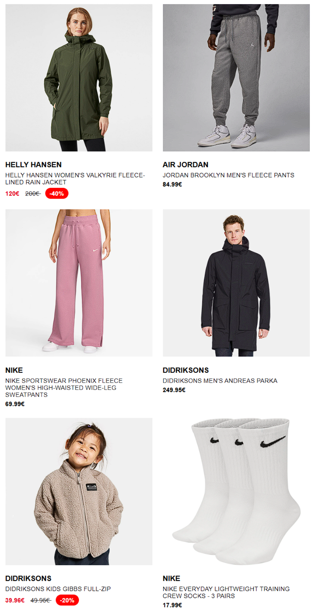
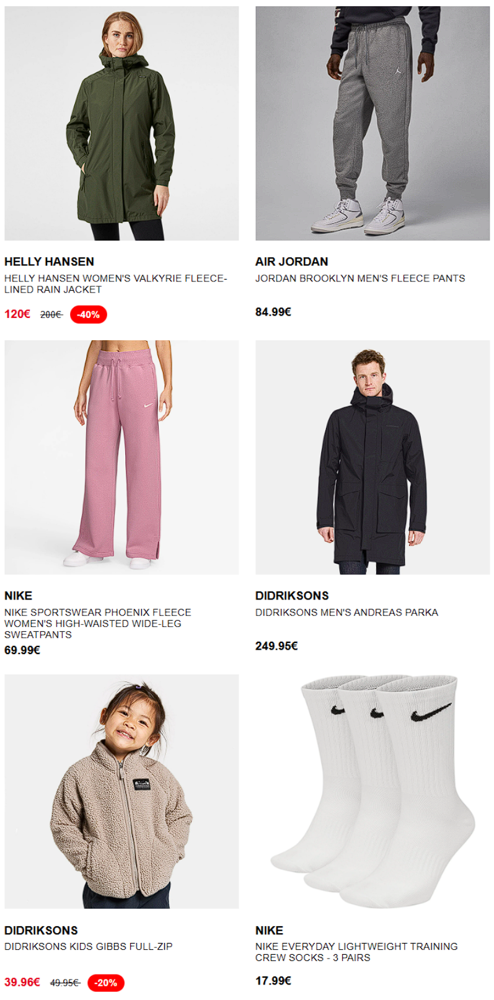

# 📦 Repository: Bloomreach Email Dynamic Blocks – Showcase Only

**Description:**
This repository showcases a collection of reusable, production-quality email block designs built for Bloomreach-powered campaigns. These blocks were implemented using robust, Outlook-compatible HTML, inline CSS, and dynamic templating logic (e.g., ``, `{{ }}`), and have been successfully deployed in real-world eCommerce campaigns.

> ⚠️ **Note**: The actual HTML code has been removed from this repository to respect confidentiality agreements. The designs and logic documented here represent the structure and features of the original work but do not include proprietary client code.

---

## 📁 Folder Structure

```plaintext
assets/
├── minimal_three_col_block.png
├── three_column_discount_grid.png
├── two_column_discount_block.png
├── two_column_outlook_safe_block.png
```

---

## 🔧 Features Overview

### ✅ Common Features (All Blocks)
- Designed for use with `recommendations(params.recommendationID, params.itemsCount)`
- Display product `title`, `image`, `url`, and optionally `brand`
- Responsive and table-based for maximum email client compatibility
- Inline CSS for consistent rendering across Gmail, Outlook, Apple Mail, etc.

### ⚙️ Conditional Features (Available in Specific Blocks)
- **Auto-calculated discounts** when `discount_percentage` is not available
- **Title truncation** for long product names (to maintain layout integrity)
- **Fallback table structures** for Outlook rendering (in select blocks)
- **Price formatting** (whole number detection, strike-through original price, etc.)

---

## 🧩 Email Block Previews

### 🔹 Minimal Three Column Block

- Clean 3-column grid  
- No pricing or discount display  
- Ideal for new arrivals or inspiration modules

---

### 🔹 Three Column Discount Grid

- Compact 3-column layout  
- Shows price, original price, and discount badge  
- Automatically calculates discount if missing  
- Truncates long titles to preserve layout

---

### 🔹 Two Column Discount Block

- Side-by-side product promotion  
- Displays brand, price, and discount details  
- Balanced and readable for most inboxes

---

### 🔹 Two Column Outlook Safe Block

- Uses conditional tables for Outlook compatibility  
- Ensures correct layout even in legacy email clients  
- Full pricing and discount logic included

---

## 📝 Usage Disclaimer
These designs are provided as a **portfolio showcase only**. The code and logic behind the blocks are part of client-owned systems and are not available for distribution.

If you would like more information or custom email design work, feel free to get in touch with [GitHub profile](https://github.com/Alessio76184) or LinkedIn.

---

## 👨‍💻 Author
**Alessio Casablanca**  
Conversion Strategist & Frontend Developer

---

## 📄 License
This project is shared as a **non-distributable showcase** only. All rights to the underlying source code and logic are retained by the original client. No license applies.
